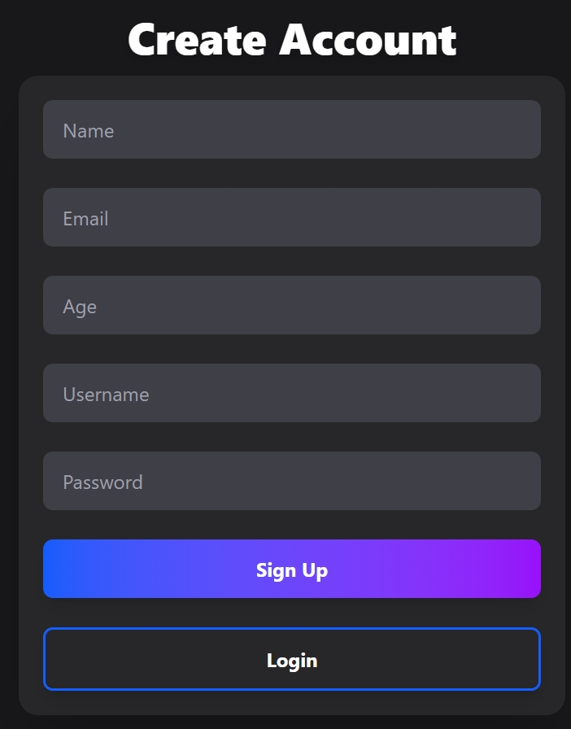
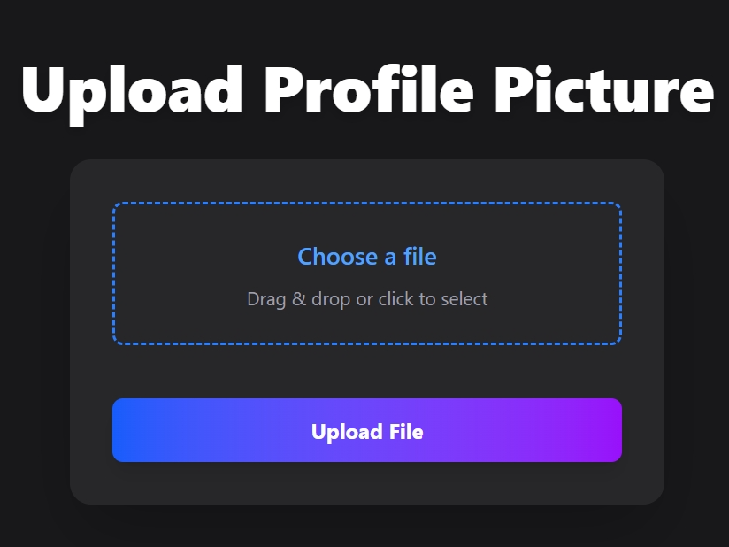

# MongoDB Auth System

A robust authentication system featuring login, signup, profile management, and file uploads. Built with MongoDB, JWT, bcrypt, multer, and a modern React frontend.

## Table of Contents

- [Features](#features)
- [Technologies Used](#technologies-used)
- [Project Structure](#project-structure)
- [Installation](#installation)
- [Usage](#usage)
- [Screenshots](#screenshots)
- [License](#license)

## Features

- User registration and login with JWT authentication
- Secure password hashing with bcrypt
- Profile management (view and update user info)
- Avatar/image upload using multer
- Protected routes and session management
- Responsive React frontend with Tailwind CSS

## Technologies Used

- **Backend:** Node.js, Express.js, MongoDB, Mongoose, JWT, bcrypt, multer
- **Frontend:** EJS, Tailwindcss

## Project Structure

```
mongodb-auth-system/
├── config/               # Utils
│   ├── multerconfig.js/
├── models/               # Mongodb Database
│   ├── post.js/
│   └── user.js/
├── public/               # Static files
│   ├── images/
│       ├── uploads/
│           ├──default.webp
├── screenshots/               # Screenshots
│   ├── createacc.png
│   ├── login.png
│   ├── profile.png
│   ├── profilepic.png
├── views/               # Engine
│   ├── edit.ejs
│   ├── index.ejs
│   ├── login.ejs
│   ├── profile.ejs
│   ├── profileupload.ejs
├── .gitignore/
├── app.js/
├── license.txt/ 
├── package-lock.json/ 
├── package.json/ 
└── README.md
```

## Installation

Follow these steps to set up the project locally:

1. **Clone the repository:**
    ```bash
    git clone https://github.com/Roshan-Metrix/mongodb-auth-system.git
    ```

2. **Navigate to the project directory:**
    ```bash
    cd mongodb-auth-system
    ```

3. **Install dependencies:**
    ```bash
    npm install
    ```

6. **Start the server:**
    ```bash
    node app.js
    ```

## Usage

- Register a new user via the signup page.
- Login to receive a JWT token.
- Access and update your profile.
- Upload an avatar or profile image.
- All protected routes require a valid JWT.

## Screenshots

### Signup Page



### Login Page


### Profile Page


### Profile Pic Upload



## License

This project is licensed under the [MIT License](license.txt).
